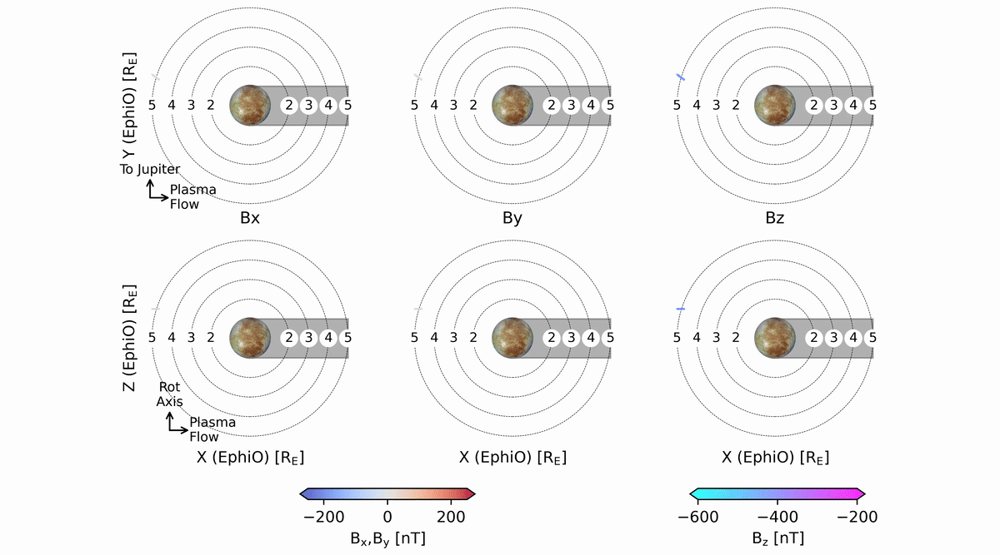

## Official implementation of “LEAP: A Rapid Neural Surrogate of Multi-Fluid MHD at Europa" 

## Overview
**Learning Europa's Atmosphere and Plasma (LEAP)** is a transformer-based model that predicts the magnetic field along spacecraft trajectories at Jupiter's moon Europa. It is trained on outputs from a state-of-the-art multi-fluid magnetohydrodynamic (MHD) model representing Europa's plasma environment. 

Accurate characterization of Europa’s plasma environment is essential for interpreting magnetic induction measurements used to constrain the properties of its subsurface ocean. These measurements are central to the science objectives of the Europa Clipper and JUICE missions in the search for life beyond Earth.

LEAP complements full MHD simulations by providing rapid, high-fidelity predictions along spacecraft trajectories, accelerating and enhancing this scientific goal.



## Features
- 🏎️ Runs **40,000× faster** than the full MHD simulations with comparable trajectory-level accuracy
- ⚗️ **Enables new science:** large scale parameter surveys and probabilistic estimates of plasma conditions
- 📈 Trained on ~48,000 rotationally augmented trajectories (~9m learnable time steps)
- 🚀 Designed to scale to **Europa Clipper and JUICE** mission data and novel MHD runs over the next 15+ years
- 🪐 Extendable to other high-priority bodies of interest, including **Enceladus, Uranus, and Neptune**

## Install

### Option 1: Conda (Recommended)
```bash
git clone https://github.com/reddy-sachin/LEAP.git
cd LEAP
conda env create -f environment.yml
conda activate leap_env
```

### Option 2: Pip only
```bash
git clone https://github.com/reddy-sachin/LEAP.git
cd LEAP
pip install -r requirements.txt
```

## Usage

### Interactive Notebook (Quickstart)
For making predictions on custom flybys with adjustable plasma conditions:
```bash
jupyter notebook notebooks/quickstart.ipynb
```
See [`notebooks/README.md`](notebooks/README.md) for details.

### Command Line
When running for the first time, the required dataset and model are automatically downloaded from Hugging Face (`reddysachin/LEAP_dataset`, `reddysachin/LEAP`) and cached locally. Subsequent runs reuse the cache.

**There are two primary modes of operation:**

(1) Train and evaluate from scratch
```bash
python main.py --train-eval

```
Outputs:
- `data/out/test_results.csv`
- `data/out/metrics.txt`
- `assets/figure3.png`

Hyperparameter adjustsments are also possible, for example:
```bash
python main.py --train-eval --n-epochs 50 --patience 8 --lr 2e-3
```
see `utils/config.py` for more

(2) Evaluate only. This uses published HF test split + pretrained artifacts
```bash
python main.py --eval-only
```
Outputs:
- `data/out/test_results.csv`
- `data/out/metrics.txt`
- `assets/figure3.png`

**For additional analyses or adaptations, please contact the authors.**

## Referencing
If you find this method and/or code useful, please cite it:

ArXiv [pre-print]: https://arxiv.org/abs/2606.10215

Reddy, S. A., Azari, A., Cochrane, C., Jia, X., Nordheim, T., Mandrake, L., Vance, S., Harris, C. & Ciuca, I. (In-review). LEAP: A Rapid Neural Surrogate of Multi-Fluid MHD at Europa. 

